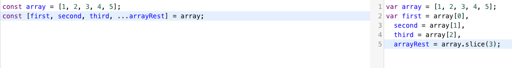
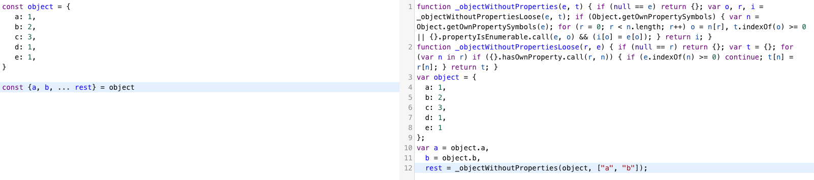
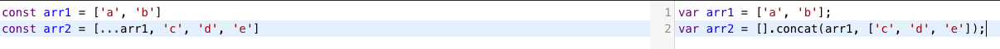
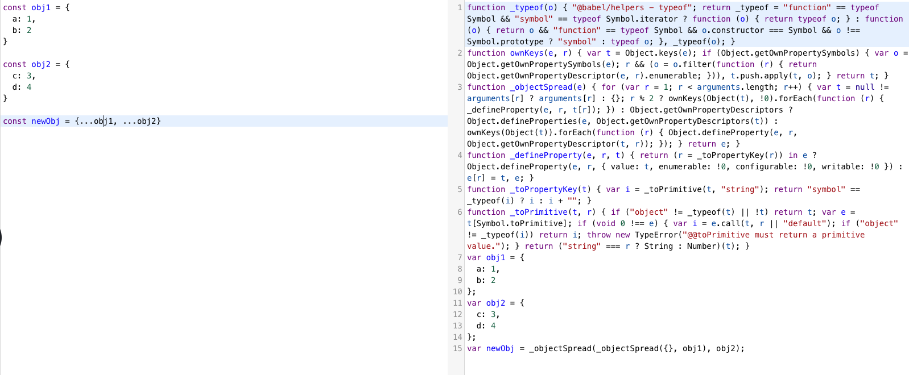
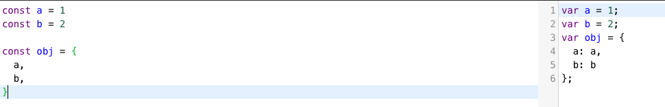
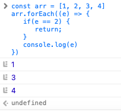
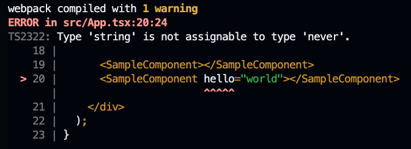

# 바벨 트랜스 파일링 예시

링크 : https://babeljs.io

## array 디스트럭처링 시


## object 디스트럭처링 시


이 처럼 배열의 경우와 다르게 객체의 경우 구조 분해 할당을 트랜스파일할 경우 번들링 크기가 상대적으로 커진다.

## 배열 생성시 스프레드 문법


## 객체 생성시 스프레드 문법


객체 분해 할당을 트랜스파일한 결과와 비슷하다. 트랜스파일된 코드가 커기즌 것을 확인할 수 있다. 따라서 object spread 문법을 사용할 때 번들링이 커지므로 주의가 필요하다

## object shorthand

단순히 키와 값 할당 형식으로 변경되었으므로 큰 부담이 없는 것을 확인할 수 있다.

## Array.prototype.map, Array.prototype.filter, Array.prototype.reduce, Array.prototype.forEach 의 경우 ES5에서도 사용했으므로 트랜스파일링시 번들링 크기는 신경쓰지 않아도 된다.

Array.prototype.forEach의 경우 중간에 return해도 배열 순회를 멈출 수 없다.

```javascript
const arr = [1, 2, 3, 4]
arr.forEach((e) => {
   if(e == 2) {
      return;
   }
   console.log(e)
})
```



무조건 forEach로 순회시 시간복잡도는 O(n)이므로 최적화 가능성이 있는지 검토할 필요가 있다.

# 타입스크립트
플레이 그라운드 : 
https://www.typescriptlang.org/play/?#code/PTAEHUFMBsGMHsC2lQBd5oBYoCoE8AHSAZVgCcBLA1UABWgEM8BzM+AVwDsATAGiwoBnUENANQAd0gAjQRVSQAUCEmYKsTKGYUAbpGF4OY0BoadYKdJMoL+gzAzIoz3UNEiPOofEVKVqAHSKymAAmkYI7NCuqGqcANag8ABmIjQUXrFOKBJMggBcISGgoAC0oACCbvCwDKgU8JkY7p7ehCTkVDQS2E6gnPCxGcwmZqDSTgzxxWWVoASMFmgYkAAeRJTInN3ymj4d-jSCeNsMq-wuoPaOltigAKoASgAywhK7SbGQZIIz5VWCFzSeCrZagNYbChbHaxUDcCjJZLfSDbExIAgUdxkUBIursJzCFJtXydajBBCcQQ0MwAUVWDEQC0gADVHBQGNJ3KAALygABEAAkYNAMOB4GRonzFBTBPB3AERcwABS0+mM9ysygc9wASmCKhwzQ8ZC8iHFzmB7BoXzcZmY7AYzEg-Fg0HUiQ58D0Ii8fLpDKZgj5SWxfPADlQAHJhAA5SASPlBFQAeS+ZHegmdWkgR1QjgUrmkeFATjNOmGWH0KAQiGhwkuNok4uiIgMHGxCyYrA4PCCJSAA

## props의 value가 never타입인 경우 props전달 불가

```typescript
import React from 'react';

type Props = Record<string, never>
type State = {
   counter: 0
}

class SampleComponent extends React.Component<Props, State> {
   constructor(props: Props) {
      super(props);
      this.state = {
         counter: 0
      }
   }

   render() {
      return<>...</>
   }
}

export default SampleComponent;
```



## instance of를 사용하여 특정 클래스의 인스턴스인지 확인하기
```typescript
class UnAuthorizedError extends Error {
    constructor() {
        super();
    }

    get message() {
        return '인증에 실패했습니다';
    }
};

class UnExpectedError extends Error {
    constructor() {
        super();
    }

    get message() {
        return '예상치 못한 에러가 발생했습니다';
    }
};

async function fetchSomething() {
    try {
        const response = await fetch('/api/something')
        return await response.json();
    } catch(e) {
        if(e instanceof UnAuthorizedError) {
            // do something
        }

        if(e instanceof UnExpectedError) {
            // do something
        }

        throw e;
    }
};
```

## typeof를 통해 특정 요소의 자료형을 확인하기
```typescript
function logging(value: string | undefined) {
    if(typeof value === 'string') {
        console.log(value);
    }

    if(typeof value === 'undefined') {
        /// nothing to do
        return;
    }
}
```

## in을 통해 객체에 키가 존재하는지 확인하기

```typescript
interface Student {
    age: number
    score: number
}

interface Teacher {
    name: string
}

function doSchool(person: Student | Teacher) {
    if('age' in person) {
        person.age
        person.score
    }

    if('name' in person) {
        person.name
    }
}
```

## generic을 사용하여 다양한 타입에 대해 함수 정의하기
```typescript
function getFiratAndLast<T>(list: T[]): [T, T] {
    return [list[0], list[list.length - 1]];
}

// const [first, last] = getFiratAndLast([1, 2, 3, 4, 5]);
const [first, last] = getFiratAndLast(['a', 'b', 'c', 'd', 'e']);
```

useState에서 제네릭 사용하기
```typescript
function Component() {
   const [state, setState] = useState<string>('');
   // ...
}
```

여러개의 제네릭 사용하기
```typescript
function multipleGeneric<First, Last>(a1: First, a2: Last): [Frist, Last] {
   return [a1, a2]
}

const [a, b] = multipleGeneric<string, boolean>('true', true);
```

## index signature
동적인 객체에 대해 타입을 부여 할 수 있음
```typescript
// record 사용의 경우
type Hello = Record<'hello' | 'Hi', string>

const hello: Hello = {
   hello: 'hello',
   hi: 'hi'
}

```

```typescript
// type을 사용한 index signature

type Hello = { [key in 'hello' | 'Hi'] : string}

const hello: Hello = {
   hello: 'hello',
   hi: 'hi'
}
```

